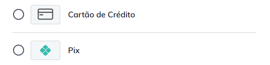
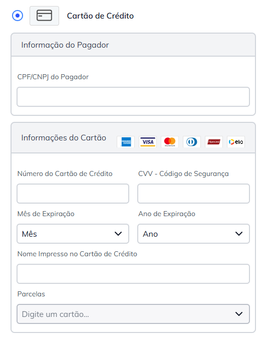
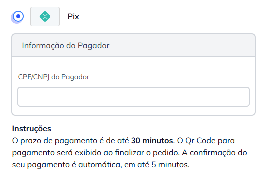

# PagBank Payment Integration for PWA Studio (Venia UI)

This extension integrates **PagBank** payment support with **PWA Studio's Venia UI**.


## Prerequisites

To ensure proper functionality, please make sure the following requirements are met in your Magento instance:

-   **PWA Studio Project**: Ensure you have a PWA Studio-based project set up.
-   **PagBank Official Module**: Install the [PagBank official Magento module](https://github.com/pagseguro/payment-magento/).
-   **PagBank GraphQL Module**: Install the [PagBank GraphQL module](https://github.com/GabrielFNLima/payment-method-pagbank-magento-graphql) to enable GraphQL support for PagBank payments.

## Installation

To install the extension, follow these steps:

1. **Add the package** to your PWA Studio project by running:

    ```shell
    yarn add @devgfnl/payment-method-pagbank-pwa-studio
    ```

2. **Update `package.json`**: In the root directory of your project, modify your `package.json` by adding `@devgfnl` to the trusted vendors in the `pwa-studio` section:

    ```json
    "pwa-studio": {
      ...
      "trusted-vendors": [
        "@devgfnl"
      ]
    }
    ```

## Supported Payment Methods

### Credit Card

-   **Vault**: Coming soon.
-   **3D Secure (3DS) Authentication**: Coming soon.



### Pix

Supported.



### Boleto

Coming soon.

### Pay with PagBank

Coming soon.

For specific issues related to this integration, please [open an issue on GitHub](https://github.com/GabrielFNLima/payment-method-pagbank-pwa-studio/issues) or visit the [wiki for common errors](https://github.com/GabrielFNLima/payment-method-pagbank-pwa-studio/wiki).
